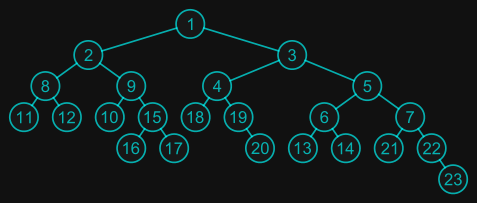

# bitreeviz is a tool for binary tree visualization.
  

## Quick start.
1, Run the follow two command:  
```
echo "bitree = 1(2,3)" >> bitree.txt
./bitreeviz bitree.txt
```
2, It will output "bitree.txt.pdf", you can open it to see the result.  
3, There are more samples in doc/samples directory you can try.  

## How to build bitreeviz from source code.
1, Install MSYS2 from www.msys2.org  
2, Goto MSYS2 shell and run:
```
pacman -S base-devel mingw-w64-x86_64-toolchain git
source shell mingw64
pacman -S cmake mingw-w64-x86_64-cairomm-1.16
```
3, In the shell, git clone this-source-code and use cmake to build it:
```
cmake -S bitreeviz/ -B build -G "MinGW Makefiles"
cmake --build build
```

## References.
https://www.cairographics.org/  
https://reingold.co/graph-drawing.shtml


